# Architecture des Microservices

## Diagramme d'Architecture

```mermaid
graph TB
    subgraph "Client/Browser"
        C[👤 Client]
    end

    subgraph "Public Network"
        C --> GW[🚪 API Gateway<br/>Port 8080]
    end

    subgraph "Docker Network (microservices-network)"
        GW --> AM[🎵 API Musique<br/>Port 2500<br/>⚠️ Non exposé]
        GW --> AJ[🎲 API Jeux<br/>Port 3000<br/>⚠️ Non exposé]
    end

    subgraph "Routes API Gateway"
        R1["/api/musiques/*"]
        R2["/api/jeux/*"]
        R3["/health"]
        R4["/api"]
    end

    subgraph "API Musique Endpoints"
        M1["GET /musiques"]
        M2["GET /musiques/:id"]
        M3["POST /musiques"]
        M4["PUT /musiques/:id"]
        M5["DELETE /musiques/:id"]
        M6["GET /musiques/random"]
        M7["GET /health"]
    end

    subgraph "API Jeux Endpoints"
        J1["GET /jeux"]
        J2["GET /jeux/:id"]
        J3["POST /jeux"]
        J4["PUT /jeux/:id"]
        J5["DELETE /jeux/:id"]
        J6["GET /health"]
    end

    subgraph "CI/CD Pipeline"
        GH[📦 GitHub Actions]
        DH[🐳 Docker Hub]
        RN[☁️ Render]

        GH --> DH
        DH --> RN
    end

    GW -.-> R1
    GW -.-> R2
    GW -.-> R3
    GW -.-> R4

    AM -.-> M1
    AM -.-> M2
    AM -.-> M3
    AM -.-> M4
    AM -.-> M5
    AM -.-> M6
    AM -.-> M7

    AJ -.-> J1
    AJ -.-> J2
    AJ -.-> J3
    AJ -.-> J4
    AJ -.-> J5
    AJ -.-> J6

    style GW fill:#e1f5fe
    style AM fill:#fff3e0
    style AJ fill:#f3e5f5
    style C fill:#e8f5e8
    style GH fill:#fff8e1
    style DH fill:#e3f2fd
    style RN fill:#f1f8e9
```

## Comment Utiliser ce Diagramme

### 1. Dans GitHub/GitLab

- Copiez le code entre les balises \`\`\`mermaid et \`\`\`
- Collez-le dans un fichier `.md` de votre repository
- GitHub/GitLab afficheront automatiquement le diagramme

### 2. Outils en Ligne

- [Mermaid Live Editor](https://mermaid.live/)
- [Draw.io avec support Mermaid](https://app.diagrams.net/)
- [VS Code avec extension Mermaid](https://marketplace.visualstudio.com/items?itemName=bierner.markdown-mermaid)

### 3. Export en Image

- Utilisez Mermaid Live Editor pour exporter en PNG/SVG
- Intégrez l'image dans vos présentations ou documentation

### 4. Dans une Documentation

- Ajoutez ce fichier à votre documentation projet
- Référencez-le dans votre README principal
